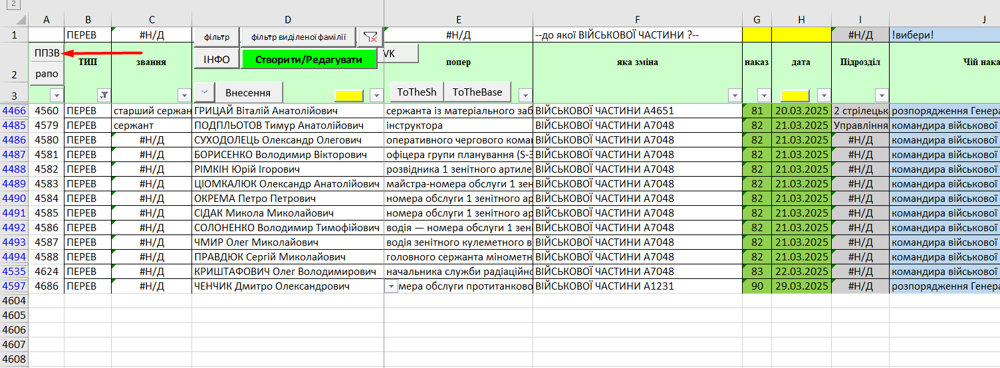

# GUIDE HACAZIST pro

> - [Лікування](#лікування)
> - [Відпустка](#відпустка)
> - [Відрядження](#відрядження)
> - [ТВО](#тво)
> - [СЗЧ в наказ](#сзч)
> - [500/200](#500200)
> - [Розпорядження](#розпорядження)
> - [Призупинка служби](#призупинка-служби)
> - [Переведення](#переведення)
> - [Зарахування в розпорядження ново прибулих з навчальних центрів](#зарахування-в-розпорядження-ново-прибулих-з-навчальних-центрів)

> ### Лікування
>
> #### Вибуття на лікування
>
> Вибуття по направленню, рапорту, іменному списку (300), повідомлення інших в/ч, використовується `form_all` -> `Хворі V2` -> перша половина форми `ВИБУТТЯ`.
>
> #### Завершення лікування
>
> Використовується `form_all` -> `Хворі V2` -> друга половина форми `ПРИБУТТЯ`.

> ### Відпустка
>
> #### Вибуття у відпустку
>
> Використовується `form_all` -> `Відпустки V2` -> перша половина форми `ВИБУТТЯ`.  
> Для надання відпустки для лікування потрібно обов'язково вказати довідку ВЛК
> Після заповнення всіх даних і натискання на кнопку додати з'явиться запис на вкладі `ВІДПУ` і `Наказ в процесі`, потрібно стати на створений запис на вкладці `Наказ в процесі` і натиснути на кнопку `квиток`.
>
> #### Завершення відпустки
>
> Використовується `form_all` -> `Відпустки V2` -> друга половина форми `ПРИБУТТЯ`.  

> ### Відрядження
>
> #### Вибуття у відрядження
>
> Використовується `form_all` -> `Відрядження` -> перша половина форми `ВИБУТТЯ`.   
> Після натиснення на кнопку `додати` з'явиться запис вкладці `ВІДР`, потрібно стати на створений запис і натиснути на кнопку `посв`.
>
> #### Завершення відрядження
>
> Використовується `form_all` -> `Відрядження` -> друга половина форми `ПРИБУТТЯ`.  

> ### ТВО
>
> Для встановлення ТВО в\с використовується `form_all` -> `ТВО` -> перша половина форми.
> Для припинення ТВО використовується `form_all` -> `ТВО` -> перша половина форми.

> ### СЗЧ
>
> Для подачі в\с в СЗЧ потрібно використовується `form_all` -> `СЗЧ в наказ`. при виборі `вибув/прибув` ми або подаємо в СЗЧ або повертаємо з СЗЧ.

> ### 500/200
>
> Для встановлення статусу потрібно переключитися на вкладку `НАКАЗ в процесі` відкрити приховані рядки (в верху таблиці кнопка +) і скопіювати весь рядок з назвою `200/500` вставляємо в кінець стобця, замість назви `200/500` вписуємо ПІБ в\с,в клітинку `А` потрібно написати інкремент попереднього  числа, в клітинку `E` вписуємо 200/500, в клітинку `I` населений пункт, в клітинку `L` потрібно скопіювати і вставити як значення в ту ж клітинку, в клітинку `N` дату дії, в клітинку `U` підставу, в клітинці `AI` отримуємо текст для наказу.

> ### Розпорядження
>
> Для зарахування в розпорядження в/с потрібно перейти на вкладу `Arrows` стати в першу пусту клітинку і натиснути на кнопку `Створити\Редагувати`, відкриється форма заповніть ті поля які відмічені червоним    після заповнення натисніть кнопку створити запис.
Текст для вставлення знаходиться в клітинці `AE`. Після завершення дій в владці `Arrows` потрібно перейти в вкладку `sh` знайти запис в\с якого вивели в розпорядження потрібно скопіювати весь рядок і вставити як значення в кінець таблиці, підрозділ перейменувати `в розпорядження`, оригінальну записі видалити значення з клітинки `I` це звільнить посаду. Далі потрібно перейти на вкладку `НАКАЗ в процесі` видалити ПІБ з клітинки `AU`-`СЗЧ` чи `AV`-`200/500`, залежності від причини виведення в розпорядження.

> ### Призупинка служби
> Для призупинки служби в\с потрібно перейти на вкладку `Arrows` стати в першу пусту клітинку і натиснути на кнопку `Створити\Редагувати`, відкриється форма заповніть ті поля які відмічені червоним  в поле `№ Приписа` записується дата призупинки служби. Текст для вставлення знаходиться в клітинці `AF`.

> ### Переведення
> Для переведення в/с в іншу в/ч потрібно перейти на вкладку `Arrows` стати в першу пусту клітинку і натиснути на кнопку `Створити\Редагувати`, відкриється форма виберіть `ТИП` - `ПЕРЕВ`потім заповніть ті поля які відмічені червоним  номера для полів `[№ приписа, № рап. посаду здав, № Грош]` береться в реєстратора СЕДО. Для поля `Коли прибути` ставиться дата + 2 дні від переведення в/с. Після введення всіх даних потрібно нажати на кнопку `створити запис`, буде створений запис потрібно стати на цей запис і нажати на кнопку `рапорт`  після цеї дії перенаправлений на вкладку `рапорт` тут потрібно вибрати `Посаду здав`  і роздрукувати рапорт, повернутися на вкладку `Arrows` запам'ятати номер рядка  переходимо на вкладку `припис` вписуємо значення номер рядка  і друкуємо, повертаємося в вкладку `Arrows` стаємо на створений запис і натискаємо кнопку  ви переміститеся на вкладку `ппзв` Текст для вставлення знаходиться в клітинці `С82`. Далі потрібно зробити витяг із пунку на переведення і розіслати службам (ПРОД, РЕЧ, ФІН, РАО), роздрукувати 4 витяги в форматі 2 сторінки на одному аркуші і 2 витяги з дзеркальними полями двохсторонній друк 1 сторінка на 1 аркуші, ще потрібно заповнити військовий квиток всіма посадами і званнями які були в наші частині.

> ### Зарахування в розпорядження ново прибулих з навчальних центрів
> * Потрібно перейти на вкладку `base_2` скопіювати весь перший рядок з формулами і вставити в кінець таблиці.
> * Після чого потрібно вставити дані з соц. демки в цей же рядок. 
> * Перейти в вкладку `Arrows` стати в першу пусту клітинку і натиснути на кнопку `Створити\Редагувати`, відкриється форма виберіть `ТИП` - `РОЗПОРЯДЖ`потім заповніть ті поля які відмічені червоним натискаємо створити запис. 
>
>  
> 
> * В клітинці `AH` потрібно задати періодичний номер
> * В клітинці `AN` текст для вставки в наказ
